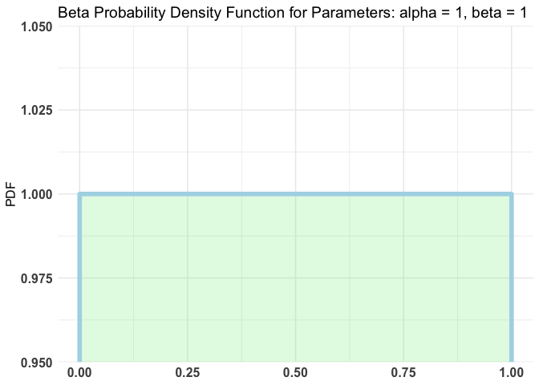
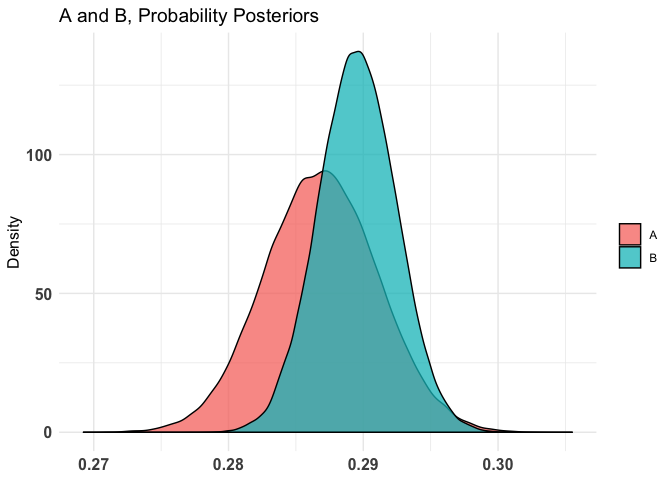
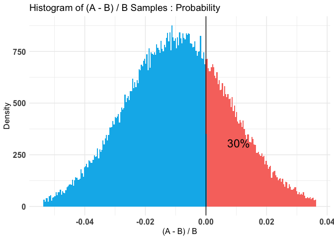
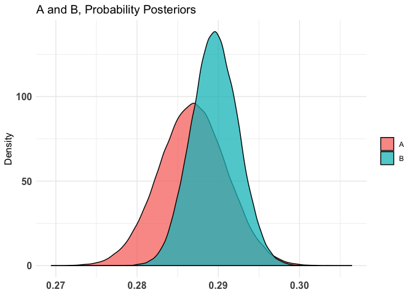
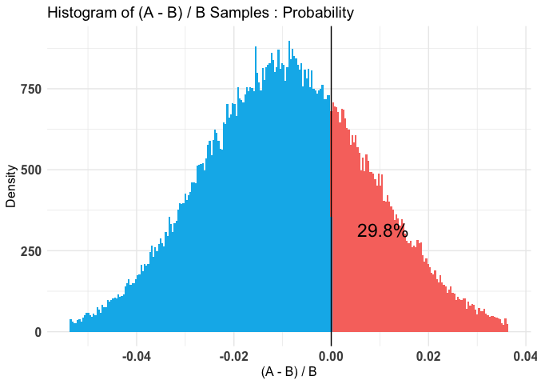

Statistical Data Analysis
================

## Bayesian Approach for Experimental Analysis

This is document explains my approach to conduct an experimental
analysis. In this case, my point of interest is CTR
(click-through-rate). From a statistical perspective, it follows
binomial distribution, which has 0/1 outcome only.

``` r
summary(cars)
```

    ##      speed           dist       
    ##  Min.   : 4.0   Min.   :  2.00  
    ##  1st Qu.:12.0   1st Qu.: 26.00  
    ##  Median :15.0   Median : 36.00  
    ##  Mean   :15.4   Mean   : 42.98  
    ##  3rd Qu.:19.0   3rd Qu.: 56.00  
    ##  Max.   :25.0   Max.   :120.00

## Including Plots

You can also embed plots, for
example:

``` r
# This file describes how to use Bayesian statistics to conduct A/B test. 
# Click through rate can be modeled by Bernoulli distribution. 
# But the click through process should be generated by binomial distribution
library(bigrquery)
library(tidyverse)
```

    ## ── Attaching packages ─────────────────────────────────────────────────────────────────────────────────────── tidyverse 1.2.1 ──

    ## ✔ ggplot2 3.2.0     ✔ purrr   0.3.2
    ## ✔ tibble  2.1.3     ✔ dplyr   0.8.3
    ## ✔ tidyr   0.8.3     ✔ stringr 1.4.0
    ## ✔ readr   1.3.1     ✔ forcats 0.4.0

    ## ── Conflicts ────────────────────────────────────────────────────────────────────────────────────────── tidyverse_conflicts() ──
    ## ✖ dplyr::filter() masks stats::filter()
    ## ✖ dplyr::lag()    masks stats::lag()

``` r
library(ggplot2)
library(bayesAB)
```

    ## 
    ## Attaching package: 'bayesAB'

    ## The following objects are masked from 'package:dplyr':
    ## 
    ##     combine, rename

``` r
setwd("/Users/victorhuangkk/Desktop/fabien/freshii_bayesian")


##### Experimental Group #####
menu_exp <- read.csv("menu_v2_experimental.csv", stringsAsFactors = FALSE)
menu_exp <- menu_exp[ which(menu_exp$Experiment.Partition.ID == 1), ]


menu_exp_df <- menu_exp %>% dplyr::select("Timestamp.Date",
                                          "Menu.Impression",
                                          "Menu.Impression.....Purchase")

# menu_exp_df <- menu_exp_df %>% 
# filter(Experiment.Partition.ID == 4)
colnames(menu_exp_df) <- c("date", "impression", "purchase")

menu_exp_df$purchase <- as.numeric(sub("%", "",
                                       menu_exp_df$purchase, fixed=TRUE))/100

menu_exp_df$impression <- as.numeric(sub(",", "", menu_exp_df$impression, fixed = TRUE))
menu_exp_df$purchase <- menu_exp_df$purchase * menu_exp_df$impression

# get exact number of people, getting rid of float number influence. 
num_purchase <- round(sum(menu_exp_df$purchase)) 
num_impression <- round(sum(menu_exp_df$impression))

# construct the vector containing success/failure 
purchase_vec <- rep.int(1, num_purchase)
non_purchase_vec <- rep.int(0, (num_impression-num_purchase))
total_vec <- c(purchase_vec, non_purchase_vec)

# shuffle the sample to make it looks like randomized sampling
total_vec <- sample(total_vec)
experimental <- total_vec


##### Control Group #####
menu_con <- read.csv("menu_v2_control.csv", stringsAsFactors = FALSE)
menu_con <- menu_con[ which(menu_con$Experiment.Partition.ID == 2 | menu_con$Experiment.Partition.ID == 3), ]

menu_con_df <- menu_con %>% dplyr::select("Timestamp.Date",
                                          "Menu.Impression",
                                          "Menu.Impression.....Purcharse")

#menu_con_df <- menu_con_df %>% 
#  filter(Experiment.Partition.ID == 5 | Experiment.Partition.ID == 6)

colnames(menu_con_df) <- c("date", "impression", "purchase")

menu_con_df$purchase <- as.numeric(sub("%", "",
                                       menu_con_df$purchase, fixed=TRUE))/100

menu_con_df$impression <- as.numeric(sub(",", "", 
                                         menu_con_df$impression, fixed = TRUE))

menu_con_df$purchase <- menu_con_df$purchase * menu_con_df$impression

num_purchase <- round(sum(menu_con_df$purchase))
num_impression <- round(sum(menu_con_df$impression))

purchase_vec <- rep.int(1, num_purchase)
non_purchase_vec <- rep.int(0, (num_impression-num_purchase))

total_vec <- c(purchase_vec, non_purchase_vec)

# shuffle the sample to make it looks like randomized sampling
total_vec <- sample(total_vec)
control <- total_vec


# based on common knowladge, I chose the number to be less than 50%, around 30%. 
# plotBeta(2000,3000)


test1 <- bayesTest(experimental, control, priors = c('alpha' = 1, 'beta' = 1), n_samples = 1e+05,
                   distribution = "bernoulli")
summary(test1)
```

    ## Quantiles of posteriors for A and B:
    ## 
    ## $Probability
    ## $Probability$A
    ##        0%       25%       50%       75%      100% 
    ## 0.2701781 0.2840757 0.2868822 0.2897004 0.3062267 
    ## 
    ## $Probability$B
    ##        0%       25%       50%       75%      100% 
    ## 0.2772039 0.2876072 0.2895479 0.2915118 0.3017223 
    ## 
    ## 
    ## --------------------------------------------
    ## 
    ## P(A > B) by (0)%: 
    ## 
    ## $Probability
    ## [1] 0.30012
    ## 
    ## --------------------------------------------
    ## 
    ## Credible Interval on (A - B) / B for interval length(s) (0.9) : 
    ## 
    ## $Probability
    ##          5%         95% 
    ## -0.03778547  0.01995410 
    ## 
    ## --------------------------------------------
    ## 
    ## Posterior Expected Loss for choosing B over A:
    ## 
    ## $Probability
    ## [1] 0.01281577

``` r
plot(test1)
```

<!-- --><!-- --><!-- -->

``` r
###### Control Group Internal Check ######

##### Control Group1 #####
menu_con <- read.csv("menu_v2_control.csv", stringsAsFactors = FALSE)
menu_con <- menu_con[ which(menu_con$Experiment.Partition.ID == 5), ]

menu_con_df <- menu_con %>% dplyr::select("Timestamp.Date",
                                          "Menu.Impression",
                                          "Menu.Impression.....Purcharse")

colnames(menu_con_df) <- c("date", "impression", "purchase")

menu_con_df$purchase <- as.numeric(sub("%", "",
                                       menu_con_df$purchase, fixed=TRUE))/100

menu_con_df$impression <- as.numeric(sub(",", "", 
                                         menu_con_df$impression, fixed = TRUE))

menu_con_df$purchase <- menu_con_df$purchase * menu_con_df$impression

num_purchase <- round(sum(menu_con_df$purchase))
num_impression <- round(sum(menu_con_df$impression))

purchase_vec <- rep.int(1, num_purchase)
non_purchase_vec <- rep.int(0, (num_impression-num_purchase))

total_vec <- c(purchase_vec, non_purchase_vec)

# shuffle the sample to make it looks like randomized sampling
total_vec <- sample(total_vec)
control1 <- total_vec

menu_con <- read.csv("menu_v2_control.csv", stringsAsFactors = FALSE)
menu_con <- menu_con[ which(menu_con$Experiment.Partition.ID == 6), ]

menu_con_df <- menu_con %>% dplyr::select("Timestamp.Date",
                                          "Menu.Impression",
                                          "Menu.Impression.....Purcharse")

colnames(menu_con_df) <- c("date", "impression", "purchase")

menu_con_df$purchase <- as.numeric(sub("%", "",
                                       menu_con_df$purchase, fixed=TRUE))/100

menu_con_df$impression <- as.numeric(sub(",", "", 
                                         menu_con_df$impression, fixed = TRUE))

menu_con_df$purchase <- menu_con_df$purchase * menu_con_df$impression

num_purchase <- round(sum(menu_con_df$purchase))
num_impression <- round(sum(menu_con_df$impression))

purchase_vec <- rep.int(1, num_purchase)
non_purchase_vec <- rep.int(0, (num_impression-num_purchase))

total_vec <- c(purchase_vec, non_purchase_vec)

# shuffle the sample to make it looks like randomized sampling
total_vec <- sample(total_vec)
control2 <- total_vec


test2 <- bayesTest(experimental, control, priors = c('alpha' = 1, 'beta' = 1), n_samples = 1e+05,
                   distribution = "bernoulli")
summary(test2)
```

    ## Quantiles of posteriors for A and B:
    ## 
    ## $Probability
    ## $Probability$A
    ##        0%       25%       50%       75%      100% 
    ## 0.2694415 0.2840627 0.2868744 0.2896816 0.3064154 
    ## 
    ## $Probability$B
    ##        0%       25%       50%       75%      100% 
    ## 0.2764923 0.2876103 0.2895476 0.2915101 0.3036031 
    ## 
    ## 
    ## --------------------------------------------
    ## 
    ## P(A > B) by (0)%: 
    ## 
    ## $Probability
    ## [1] 0.2982
    ## 
    ## --------------------------------------------
    ## 
    ## Credible Interval on (A - B) / B for interval length(s) (0.9) : 
    ## 
    ## $Probability
    ##          5%         95% 
    ## -0.03754683  0.01965748 
    ## 
    ## --------------------------------------------
    ## 
    ## Posterior Expected Loss for choosing B over A:
    ## 
    ## $Probability
    ## [1] 0.01283927

``` r
plot(test2)
```

<!-- --><!-- --><!-- -->

Note that the `echo = FALSE` parameter was added to the code chunk to
prevent printing of the R code that generated the plot.
