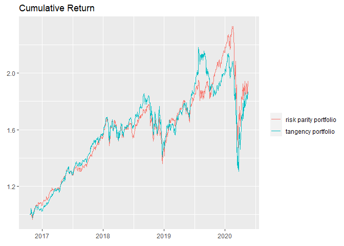
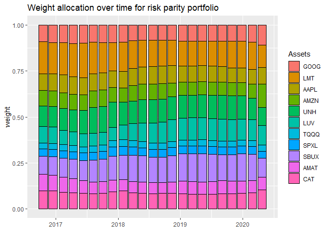

-   [Summary](#summary)
-   [Strategy I](#strategy-i)
-   [Strategy II](#strategy-ii)
-   [Portfolio Optimization](#portfolio-optimization)
-   [Backtest](#backtest)

Summary
-------

This project is to create a self use stock selection and portfolio
optimization strategy. One of the most effective and simple strategy

In general, investment is an art rather than pure science. I believe in
the value investment strategy. From a tactic perspective, By utilizing a
service called alpha\_vantage (Python),

Strategy I
----------

I would say, to minimize the risk, the portfolio should be diversified
as much as possible. Traditionally, a well diversified portfolio should be
exposed to 

-   Technology
    -   U.S.
        1.  Amazon, Apple
        2.  Uber
    -   China
        1.  Bilibili, Alibaba
        2.  Gensheixue(Online learning)
-   BioTech
    1.  Gilead Science, Crisper
-   Defense
    1.  Lockheed Martin

Strategy II
-----------

In most of the periods between 2016-2020, stocks are highly

This code chunck was implemented to calculate risk parity portfolios. In
most cases, when the entire market is gradually up, there is no need for
individule investors to hold the cash or cash equivalent, if you care
more about longer term profit rather than next month total portfolio net
value. For that reason, investment target is to maximize midterm to long
term total return. Based on this hypothesis, leveraged ETFs with risk
parity

Portfolio Optimization
----------------------

I do think portfolio optimization is useful. But we cannot simply give
the framework the complete set of stocks which contains all stocks over
the market. By intuitions, we may infer some stocks will outperform
others in short/midterm length. For example, I can assure with high
possibility that Amazon will outperform underarmor in the next one year.
This strategy helps me to construct my portfolio.

But there are two rules which cannot be broken: 1. Diversify portfolio
as much as possible 2. Never short the market

I used a Python package to conduct portfolio optimization

The mathematical formula for this optimization task is stated in below.

    ## Loading stock data from local file C:/Users/guanhua.huang/github/victorhuangkk.github.io/_scripts/stockdata_from_2015-05-20_to_2020-05-20_(64c75c1355d1ccd2ca3f2c5b4ec6e61c).RData

Backtest
--------

    # dates of the designed portfolios
    index(bt$tangency$data1$w_designed)

    ##  [1] "2016-10-20" "2016-12-16" "2017-02-15" "2017-04-13" "2017-06-12" "2017-08-08" "2017-10-04" "2017-11-30" "2018-01-30" "2018-03-28"
    ## [11] "2018-05-24" "2018-07-23" "2018-09-18" "2018-11-13" "2019-01-14" "2019-03-13" "2019-05-09" "2019-07-08" "2019-09-03" "2019-10-29"
    ## [21] "2019-12-26" "2020-02-25" "2020-04-22"

    # check performance summary
    backtestSummary(bt)$performance

    ##                   risk parity portfolio tangency portfolio
    ## Sharpe ratio                  0.8258296          0.7168205
    ## max drawdown                  0.3736189          0.4018382
    ## annual return                 0.2031849          0.1911637
    ## annual volatility             0.2460373          0.2666828
    ## Sterling ratio                0.5438292          0.4757231
    ## Omega ratio                   1.2044897          1.1786037
    ## ROT (bps)                  4578.6200190        656.9454952

    # plot cumulative returns chart
    backtestChartCumReturns(bt)

    # plot assets exposures over time
    backtestChartStackedBar(bt, portfolio = "risk parity portfolio", legend = TRUE)

